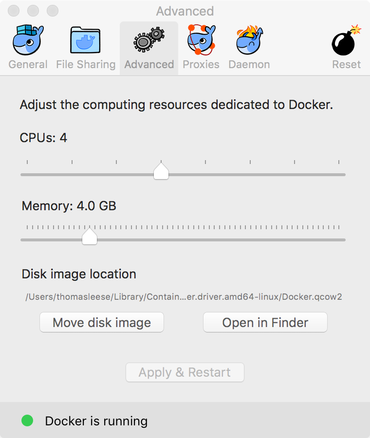

# GOV.UK Publishing End-to-end Tests

A suite of end-to-end publishing tests that allow us to test functionality
across applications and services. The idea is that we test the sequence of
actions and movement of data throughout the system in a 'real world' context,
rather than stubbing services and making assumptions about responses. The tests
are browser tests (written in [RSpec](http://rspec.info/), using
[Capybara](https://github.com/teamcapybara/capybara)) that mimic the behaviour
of content editors.

Currently we have tests for [Specialist Publisher][specialist-publisher] and
[Travel Advice Publisher][travel-advice-publisher] (which require the
supporting applications and infrastructure, including Publishing API,
Content Store, Content Schemas, Router, Frontend, Static, MongoDB, Postgres,
Redis, RabbitMQ).

## How to run the tests

### With Docker

Once you have [installed Docker][install-docker] you can build and run the test
suite with:

```
$ make
```

Running this command executes the following targets in order, which you can choose to run separately to speed up development: `clone`, `build`, `start`, `test` and `stop`.

#### Configuring Docker

We recommend that you configure Docker to use at least 4 CPUs with 4 GB of memory, otherwise you may find the apps struggle to run well enough to pass the tests.



### Without Docker

It is possible the run this suite without Docker however you will have to
set-up and configure each application in the stack and have them available
on `*.dev.gov.uk`. The tests can then be run with:

```
bundle exec rspec
```

## Docker

### Usage

- Run programs within containers using `docker-compose`:
  `docker-compose run publishing-e2e-tests bundle exec rspec`
- Get shell access to a given container: `docker-compose run specialist-frontend bash`
- Kill the containers and move on with your life: `docker-compose down`

### Adding containers

- Create a `Dockerfile` in the repository of the app you want to add.
- Edit `clone-apps.sh` to include the repository for the app.
- Define the service and its relationship to other services in
  `docker-compose.yml`

### Local apps

If you want to use a local version of an application, symlink your
directory into `./apps`. For example:
```
rm -rf apps/publishing-api
ln -s path/to/publishing-api apps/publishing-api
```

### Quirks

Docker limits the amount of disk space it uses. This sometimes results in
rather opaque errors when you try and run tasks - generally related to
errors installing Mongo or Postres. One example is
`Moped::Errors::ConnectionFailure: Could not connect to a primary node for
replica set`.

The most reliable way to fix this is to find and remove unnecessary Docker
containers and images.

```
# Find containers
docker ps -a

# Delete containers (command accepts multiple container IDs)
docker rm -f <container-id>

# Find images
docker images

# Delete images (command accepts multiple images)
docker rmi -f <image-id>
```

[install-docker]: https://www.docker.com/community-edition
[specialist-publisher]: https://github.com/alphagov/specialist-publisher
[travel-advice-publisher]: https://github.com/alphagov/travel-advice-publisher
